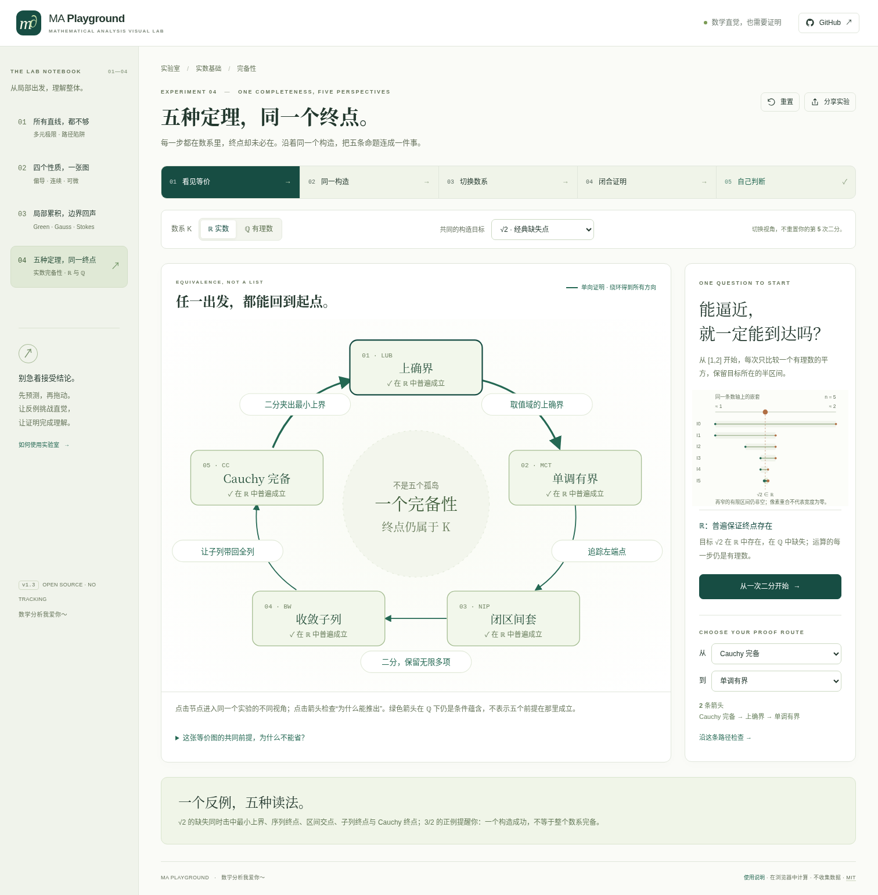

<div align="center">

# MA Playground
### Mathematical Analysis Visual Lab

**Build intuition. Then inspect the proof.**

Four complete, offline-capable experiments. No backend, CDN, account, external API or runtime dependencies.

[中文](README.md) · [Completeness guide (中文)](docs/COMPLETENESS-GUIDE.md) · [Mathematics (中文)](docs/COMPLETENESS-MATHEMATICS.md) · [Verification](docs/VERIFICATION.md)

</div>



## v1.3 — Five theorems, one missing endpoint

Why can every step be rational while the required endpoint is not?

The fourth lab connects the least-upper-bound principle, monotone convergence, shrinking nested closed intervals, Bolzano–Weierstrass, and Cauchy completeness in a **directed proof cycle**. Nodes open a common experiment through a different lens; edges open four-step proofs. A route planner makes reverse implications explicit instead of drawing unproved two-way arrows.

The learning journey is **map → one construction → change the field → close the proof cycle → transfer questions**.

Starting with `[1,2]`, exact rational bisection compares `m²` with `d`. Choose targets √2, √3 or the rational control 3/2. Preserve the same construction when switching ℝ/ℚ, changing the theorem lens or inspecting a proof.

| Lens | Interaction |
|---|---|
| Supremum | Enter a rational candidate and construct a larger set element or a smaller upper bound exactly. |
| Monotone convergence | Follow increasing lower endpoints with a common upper bound and a tail enclosure. |
| Nested intervals | Shrink and zoom, retain exact widths, distinguish each finite intersection from the infinite intersection. |
| Bolzano–Weierstrass | Select even/odd subsequences from `zⱼ=(−1)ʲaⱼ` without reordering indices; inspect why no rationally convergent subsequence exists for the irrational targets. |
| Cauchy completeness | Pick independently distant tail indices and adjust epsilon; inspect a uniform bound, not merely adjacent differences. |

Six explained questions address fields, quantifiers, subsequences, the harmonic-series trap, open intervals and uniqueness.

### Mathematical scope

The equivalence cycle is stated for an **Archimedean ordered field K**. Both ℝ and ℚ meet the shared assumptions. The nested-interval node includes nonempty closed bounded intervals, nesting and widths tending to zero, yielding a **unique point in K**. We do not silently remove the Archimedean assumption from Cauchy-complete ⇒ least upper bounds.

Conditional arrows remain valid in ℚ, while all five universal properties fail there. A successful rational example does not make ℚ complete. The missing-point marker is an ambient real reference, not a positive-width hole in dense ℚ.

BigInt rational arithmetic determines branches, witnesses, tail differences and CSV data. Floating-point square roots are used only as optional drawing references, not in the construction algorithm. Proofs cover infinitely many indices; finite pixels and tests do not establish universal theorems.

## Earlier experiments remain available

1. **Every line is not enough.** Multivariable limit paths for `x²y/(x⁴+y²)`.
2. **Four properties, one relation map.** Partial derivatives, continuity, differentiability and continuity of partial derivatives, with smooth examples, counterexamples and transfer tasks. The original two-function comparison remains at `#lab=differentiability&mode=classic`.
3. **Local accumulation, boundary effect.** Green circulation → planar flux → Gauss → curved Stokes → a common view, with independent analytical boundary/interior calculations and orientation/cancellation controls.

No existing mathematical modules or tests have been removed. The project subtitle broadens from multivariable calculus to mathematical analysis; the name remains MA Playground.

## Run

For completely offline use, double-click **`dist/completeness-lab.html`** in the delivery archive. It contains all four labs. `standalone.html`, `relations-lab.html`, and `field-lab.html` are also complete offline builds with different starting views.

For source development, use Node.js 22+:

```bash
npm run dev
npm run verify
npm run preview
```

There are no npm runtime or build-tool dependencies. Serve the modular `index.html` over HTTP; use an inlined HTML for offline file use. Sharing a local file URL does not upload the file.

## Test

```bash
npm test
npm run check
npm run build
python -m pip install -r tests/requirements.txt
python -m playwright install chromium
npm run test:ui
```

Actual v1.3 checks: **151 Node tests**; Chromium suites **29 + 37 + 27 + 38 = 131 checks**. The legacy field suite only adjusts its two navigation-count expectations for the fourth lab and additionally checks all IDs; its mathematical and interactive assertions remain.

Browser scripts normally test the production HTTP build. In this managed environment HTTP navigation was blocked by browser policy, so the real standalone build was injected using explicit `--offline-harness`. HTTP assets and subpaths were checked separately by a real Node server. This is **not** a claim of browser HTTP module-loading E2E, operating-system `file://` access, public deployment, Safari/Firefox, or a complete screen-reader audit. Details: [verification](docs/VERIFICATION.md).

## Architecture

`completeness-math/state/plots/content/lab.js` follow the existing separation of pure mathematics, validated route state, SVG views, authored teaching content and controller lifecycle. A custom no-dependency bundler builds the same modules into standalone HTML; there is no separate demo implementation.

Mobile layouts use a vertical directed cycle and synchronized controls near the plot. SVG nodes and edges have keyboard equivalents. Form inputs keep focus during updates; explicit animations stop on navigation or visibility changes. Quiz drafts stay in memory and are not shared or uploaded.

## Deployment and delivery

`npm run build` produces static `dist/`, compatible with root and repository subpaths. The existing GitHub Pages workflow now runs all four browser suites through `test:ui`. Repository authorization and Pages settings are still required.

This delivery was developed locally on the supplied v1.2 history. **No remote push or public deployment was performed in this turn.** Local history, incremental patch and verification material are included under `delivery/`. Fetch the actual remote history before merging; never overwrite it with a force push. See [status](docs/STATUS.md).

## Contribute / license

MIT. The primary UI is Chinese; this README is not a claim of a fully translated interface. No arbitrary formula parser, CAS or automatic proof engine. New content needs precise assumptions, proofs/counterexamples and tests, not empty sections. See [CONTRIBUTING.md](CONTRIBUTING.md) and [references](docs/REFERENCES.md).
