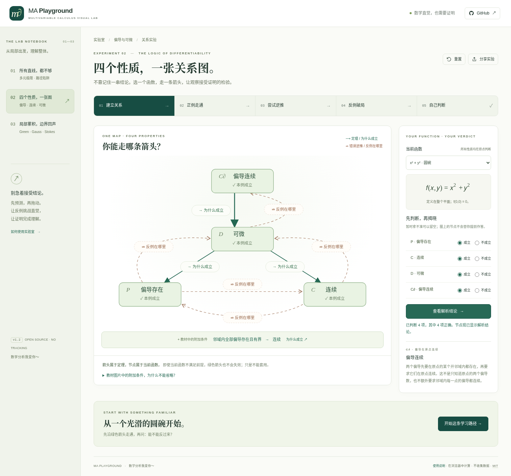

# MA Playground

**Multivariable Calculus Visual Lab — intuition that can stand up to proof.**

A dependency-free, offline-capable application for undergraduate multivariable calculus. The interface is currently Chinese. [中文说明](README.md)

## v1.2: One map, four properties

The second experiment is now a connected learning experience rather than separate fact cards:

**Build the logical map → understand the implications with smooth examples → try reversing them → find counterexamples → classify new functions.**

The nodes are partial existence at the origin, continuity at the origin, Fréchet differentiability at the origin, and partials defined on a neighbourhood and continuous at the origin. The last condition is not labelled “C¹ throughout the neighbourhood”. Green solid arrows open theorem explanations; dashed non-implications open counterexample experiments. A separate conditional arrow retains the assumption that all partials exist and are bounded on a neighbourhood before concluding continuity.

Four smooth examples, the three requested counterexamples, the original continuous-but-nondifferentiable bridge, and three transfer tasks are implemented. Surface, two-sided sections, candidate/tangent planes, shrinking-scale errors and derivative sequences use the same mathematical model. Undefined derivatives remain null; sampled trends never certify a universal theorem.



## Existing experiments remain

1. Multivariable limits: checking every straight line is insufficient.
2. Differential properties: the new relation experiment. The original two-function UI is retained under `#lab=differentiability&mode=classic` for compatibility and regression coverage.
3. Green–Gauss–Stokes: local quantities, subdivision, shared-boundary cancellation and the exterior boundary. Its mathematics and interactions were not changed in this release.

## Run

Open `dist/relations-lab.html` for the complete offline application starting at the new experiment. `dist/standalone.html` and `dist/field-lab.html` are alternative complete starting points. No backend, CDN, external fonts, API key or installation is required for these files.

For development, use Node.js 22+ in the source directory:

```sh
npm run dev
npm run verify
npm run preview
```

The ordinary ES-module `index.html` should be served over HTTP. There are no npm runtime or build dependencies.

Browser tests use Python and Playwright only during development:

```sh
python -m pip install -r tests/requirements.txt
python -m playwright install chromium
npm run test:ui
```

Default browser tests exercise served ES modules. An explicit `--offline-harness` mode loads the actual generated single-file application when browser navigation is prohibited; it does not change browser policies or claim served-module validation. See [verification](docs/VERIFICATION.md) for actual results and limitations.

## Engineering and delivery

All new state, mathematics, content, drawing and lifecycle handling live in `src/relations-*.js`, integrated into the existing second experiment. The original mathematical tests are retained, and the legacy UI suite explicitly opens its compatibility route before exercising the old assertions. New tests cover the relation UI separately.

Build output supports both a root deployment and a GitHub Pages repository subpath. The workflow runs all tests before deployment. This delivery is a local update restored from the v1.1 bundle, not a claim that the remote repository or public Pages site was updated. Preserve the real remote history when merging the supplied patch; do not force-push the local bundle.

MIT. Authored mathematical details and reference distinctions are in [RELATIONS-MATHEMATICS.md](docs/RELATIONS-MATHEMATICS.md), [guide](docs/RELATIONS-GUIDE.md), and [references](docs/REFERENCES.md). No user answers, telemetry or credentials are transmitted.
