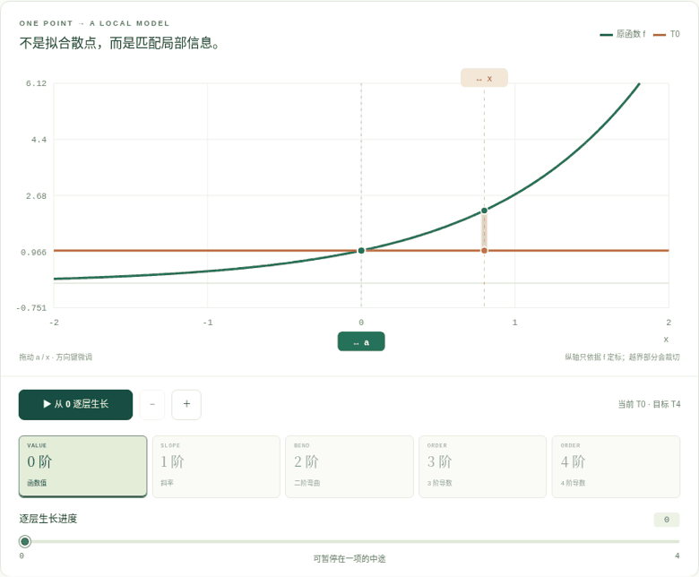

<div align="center">

# MA Playground
### Mathematical Analysis Visual Lab

**Build intuition. Then inspect the proof.**

Five complete, offline-capable experiments. No backend, CDN, account, external API or runtime dependencies.

[中文](README.md) · [Taylor guide (中文)](docs/TAYLOR-GUIDE.md) · [Mathematics (中文)](docs/TAYLOR-MATHEMATICS.md) · [Verification](docs/VERIFICATION.md)

</div>



## v1.4 — A curve, one derivative at a time

Starting with the horizontal line T₀, build a local polynomial from the derivatives at one point. The learning path is **grow → examine errors → test the limits → inspect proofs → transfer questions**.

Choose exp, sin, cos, ln(1+x), 1/(1−x), or the smooth nonanalytic example exp(−1/x²) extended by zero. Move the expansion center and probe with sliders, direct SVG dragging or keyboard controls. Select orders 0…12 and watch terms grow continuously. Pause or scrub inside a term: `T₂+0.4c₃h³` is explicitly an intermediate curve Q, not an already completed T₃.

A live derivative table distinguishes guaranteed matching, partial correction and coincidental zeros. The second derivative is not mislabeled as geometric curvature. Coefficients are analytical, not finite differences or a fit to sampled points.

Two error views independently hold the order or the observation point fixed. The remainder panel uses a bound over the entire connecting interval, never a sampled maximum. A conservative dyadic neighborhood is selected using the analytical bound; floating evaluation is not presented as certified interval arithmetic.

Four boundary presets expose real counterexamples: increasing order can worsen error; a function's domain is not its series' convergence interval; the logarithm's right endpoint requires a separate check; and a smooth function may differ from its Taylor series. The flat example's zero series has **infinite** radius but agrees with the function only at zero.

Four complete four-step proofs and eight explained, balanced-position questions finish the route. State sharing preserves fractional growth. CSV contains complete T₀…T₁₂ evaluations, assumptions and numerical-method metadata, not a mislabeled intermediate animation.

## Earlier labs remain intact

1. Multivariable limits: every straight line is not enough.
2. Partial derivatives, continuity, differentiability and continuous partials: a theorem/counterexample map.
3. Green, Gauss and Stokes: local accumulation and boundary effects.
4. Real completeness: a directed equivalence-proof cycle, exact rational bisection and ℝ/ℚ comparison.

The old two-function comparison also remains at `#lab=differentiability&mode=classic`. No prior mathematical or interactive tests were removed.

## Run

Double-click **`dist/taylor-lab.html`** from the delivery archive. It contains all five labs. `standalone.html`, `field-lab.html`, `relations-lab.html` and `completeness-lab.html` are complete offline entries with different starting views. A source-only Git checkout requires a build first.

For development, Node.js 22+:

```bash
npm run dev
npm run verify
npm run preview
```

No npm runtime or build-framework dependencies. Serve modular `index.html` over HTTP; use an inlined build for offline files. Sharing a local URL does not upload a file.

## Test and scope

```bash
npm test
npm run check
npm run build
python -m pip install -r tests/requirements.txt
python -m playwright install chromium
npm run test:ui
npm run test:ui:taylor
```

Actual v1.4 result: **203 Node tests** and **168 Chromium checks** (29+37+27+38+37). The new completeness and Taylor pages include a stage-aware “Start here” guide card. Browser scripts normally use the production HTTP build. Managed browser policy blocked HTTP navigation here, so the real built HTML was injected with explicit `--offline-harness`; policies were not altered. HTTP resources and subpaths were independently checked with a real Node server.

This is not browser HTTP module-loading E2E, OS file-policy validation, public deployment, a Safari/Firefox test, or a complete screen-reader audit. Numerical tests are not general mathematical proofs. See [verification](docs/VERIFICATION.md).

The usual explicit animation takes about 1.2 seconds per order. Reduced-motion preference uses completed-step playback instead. Navigation, hidden-page events and reset clean up animation and local handlers. Mobile layouts retain controls and textual/derivative alternatives.

## Architecture

Pure formulas (`taylor-math`), validated state (`taylor-state`), SVG views (`taylor-plots`), authored lessons/proofs (`taylor-content`) and lifecycle-managed interaction (`taylor-lab`) follow the existing separation. The custom no-dependency bundler inlines the same source modules, not a separate demo.

## Delivery and deployment

`npm run build` produces static `dist/` for root or repository subpaths. The existing Pages workflow now runs all five browser suites. This iteration was developed from the supplied v1.3 local history; **v1.4 was pushed normally, GitHub Actions Run #13 passed, and the public GitHub Pages site was verified.** Incremental patch and full local bundle are in `delivery/`. Inspect the actual remote before merging; do not force-overwrite its history. See [status](docs/STATUS.md).

## Contribute / license

MIT. Main UI and authored proof pages are Chinese; this README is not a claim of full interface translation. No arbitrary-expression parser, CAS, tracking or automatic proof engine. New content needs explicit assumptions, proof/counterexample, pedagogical purpose and tests. See [contributing](CONTRIBUTING.md) and [references](docs/REFERENCES.md).
