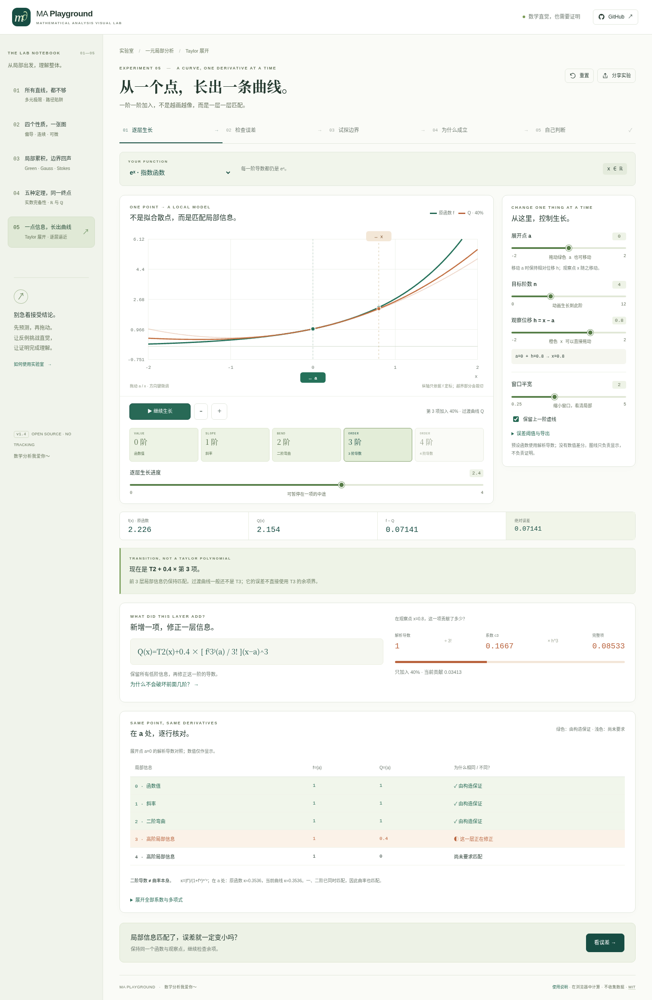

<div align="center">

# MA Playground
### Mathematical Analysis Visual Lab · 数学分析可视化实验室

**让数学直觉，经得起证明。**

五个完整实验，把观察、计算、定义与证明接起来。无后端、无登录、无 CDN，可完全离线运行。

[English](README.en.md) · [Taylor 操作指南](docs/TAYLOR-GUIDE.md) · [完整数学推导](docs/TAYLOR-MATHEMATICS.md) · [实际验证](docs/VERIFICATION.md) · [交付状态](docs/STATUS.md)

</div>


## v1.4 · 从一个点，长出一条曲线

**只知道一个点的各阶导数，怎样一步步构造局部逼近？**

第五个实验围绕这个问题，串起一条连续路线：

**逐层生长 → 检查误差 → 试探边界 → 为什么成立 → 自己判断。**

默认从水平线 T₀ 开始。选择函数、拖动展开点 a、调整目标阶数 n，再播放逐项生长。不是随机拟合散点：每个系数都来自函数在 a 的解析导数。

### 让每一次生长都有数学含义

| 交互 | 学生能检查什么 |
|---|---|
| 0→1→2→… 连续生长 | 新项怎样改变曲线，又怎样不破坏已匹配的低阶导数。 |
| 生长进度拖动 / 暂停续播 | 停在 T₂+0.4c₃h³ 时，页面标为过渡曲线 Q，不冒充完整 T₃。 |
| 展开点和观察点手柄 | 直接拖动 a 或 x；移动 a 保持 h=x−a 不变，重新计算全部系数。也支持滑块与键盘。 |
| 导数对照与系数账本 | 函数值、斜率、二阶导数和高阶信息逐行匹配。二阶导数与几何曲率分开。 |
| 两种误差观察 | 固定阶数改变距离；固定 x 对比 T₀…T₁₂。新增零项与误差变大的情形不被隐藏。 |
| 解析余项界 | 用整个连接区间的导数上界，而非有限采样最大值。额外给出保守整段邻域半径。 |
| 同一参数进入证明 | 四条四步推导；8道带理由反馈的判断题。分享保留包括小数生长进度在内的状态。 |

### 六个函数，一组统一操作

`eˣ`、`sin x`、`cos x`、`ln(1+x)`、`1/(1−x)`，再加原点补零的 `exp(−1/x²)`。

在“试探边界”中，一键进入四个真实参数预设：加一阶反而变差、越过几何级数收敛半径、对数的可收敛右端点，以及无限光滑却不解析的反例。这些是同一个实验的参数变化，不是另外几份演示代码。



### 数学与数值的边界

- Taylor 系数为 `f^(k)(a)/k!`，Horner 法求值；未使用数值差分、任意表达式解析或通用 CAS。
- 过渡曲线 Q 不直接套用完整 Tₙ 的余项界。余项定义、固定阶局部极限、固定点的无穷级数收敛分开。
- 函数定义域、收敛半径和有限阶的误差阈值半径分开。对数右端点单独判断；flat 例子的零级数收敛半径是 ∞，却只在原点等于函数。
- 一般浮点差接近分辨率时明确标注；几何余项用有限恒等式避免相消。图中无定义点断开，不能补零。数值测试和有限图像不证明无限过程。
- 所谓“整段保证”来自解析充分公式；代码对公式作浮点估值，不声称区间算术认证或形式化证明。

详见 [TAYLOR-MATHEMATICS.md](docs/TAYLOR-MATHEMATICS.md)。

## 原有四个实验完整保留

| 实验 | 内容 |
|---|---|
| **01 所有直线，都不够** | 多元极限的直线/抛物线路径陷阱、反证、对照与三维示意。 |
| **02 四个性质，一张图** | 偏导存在、连续、可微、偏导连续的定理/反例关系图。四个光滑正例与经典反例。见 [关系实验指南](docs/RELATIONS-GUIDE.md)。 |
| **03 局部累积，边界回声** | Green→平面通量→Gauss→Stokes，同一场的局部量、内部抵消、边界效应与证明。见 [场实验指南](docs/FIELD-GUIDE.md)。 |
| **04 五种定理，同一终点** | 上确界→单调有界→区间套→BW→Cauchy 的有向证明环；BigInt 有理数二分、ℝ/ℚ 对照。见 [完备性指南](docs/COMPLETENESS-GUIDE.md)。 |

旧双函数比较仍可由 `#lab=differentiability&mode=classic` 进入。没有删除旧数学模块或旧交互测试；导航数量随第五模块增至5。

## 立即运行

**无需安装：** 在完整交付包中双击 **`dist/taylor-lab.html`**。该单文件包含全部五个实验。

| 完整离线入口 | 初始页面 |
|---|---|
| `dist/taylor-lab.html` | Taylor 逐层生长 |
| `dist/completeness-lab.html` | 实数完备性的等价图 |
| `dist/relations-lab.html` | 偏导与可微关系图 |
| `dist/field-lab.html` | Green–Gauss–Stokes |
| `dist/standalone.html` | 多元极限 |

所有入口都无 CDN、外部字体、API Key、账号或后台请求。源代码仓库不追踪生成的 dist；从 Git 克隆源码后先构建。

**开发：** Node.js 22+，没有 npm 运行依赖或构建框架依赖。

```bash
npm run dev        # 本地开发服务器
npm run verify     # 语法、数学/状态/工程测试、生产构建
npm run preview    # 浏览 dist/ 生产构建
```

普通模块入口 `index.html` 经 HTTP 打开；双击离线请用合并的 HTML。分享本机文件地址不会把文件上传到网络。

## 测试

```bash
npm test
npm run check
npm run build

# 开发测试依赖，不参与应用运行
python -m pip install -r tests/requirements.txt
python -m playwright install chromium
npm run test:ui
# 或只运行第五模块
npm run test:ui:taylor
```

v1.4 实际通过 **203 项 Node 检查**；五套 Chromium 检查 **29 + 37 + 27 + 38 + 37 = 168 项**。新增的完备性与 Taylor 页面均带有按页面阶段切换的本页导览卡片。

浏览器脚本默认使用生产 HTTP 入口。当前受管理环境阻止 HTTP 导航，实际采用显式 `--offline-harness`，将真正构建的完整单文件注入空白页执行；没有修改浏览器策略。HTTP 资源和子路径由真实 Node 服务独立检查。

因此不声称已完成浏览器 HTTP 模块加载全链路、操作系统文件策略、公开站点、Safari/Firefox 或完整屏幕阅读器验收。见 [验证记录](docs/VERIFICATION.md)。

## 工程结构

```text
src/
  app.js / state.js          全局导航、路由、分享、控制器生命周期
  math.js / plots.js         原极限与经典比较
  relations-*.js             偏导逻辑图
  field-*.js                 Green–Gauss–Stokes
  completeness-*.js          实数完备性与精确有理数构造
  taylor-math.js             解析系数、余项、半径、局部界、CSV
  taylor-state.js            参数白名单、小数生长进度、情境预设
  taylor-plots.js            裁切/断线 SVG、曲线、误差与收敛区间
  taylor-content.js          连续学习路径、四条证明、八道迁移题
  taylor-lab.js              动画、指针/键盘、同步读数、答案草稿
styles/                     共用纸白/鼠尾草绿笔记本视觉体系
scripts/                    无依赖构建、单文件合并、本地服务器
tests/                      数学/内容/状态/工程及五套浏览器回归
docs/                       完整数学、操作指南、验证记录和实际截图
.github/workflows/          所有检查成功后在 main 部署 Pages
```

通常动画约1.2秒/阶；减少动态效果偏好下，显式播放改为每约950ms跳到下一完整阶。进入别的模块、切页或隐藏浏览器时清理动画。没有自动开始播放。输入更新保留焦点，图形旁提供文字与导数表，手机重新排布控制器。

## 部署与交付状态

`npm run build` 输出纯静态 `dist/`，支持根路径和 `/MA_playground/`。既有 GitHub Pages 工作流的 `test:ui` 已接入第五套检查，全部通过才允许部署。

**v1.4 的远端推送与公开 Pages 验证将在本次本地验证通过后完成。** 本地提交、基线、差异补丁、bundle 和核验材料见交付包 `delivery/`；后续更新仍应读取真实远端历史，不要用本地 bundle 强制覆盖。详见 [STATUS.md](docs/STATUS.md) 与 [DEPLOYMENT.md](docs/DEPLOYMENT.md)。

## 贡献与许可

MIT。主要 UI 为中文。新增实验应提供数学条件、证明/反例、交互目的和测试，不增加空白章节。见 [CONTRIBUTING.md](CONTRIBUTING.md) 与 [REFERENCES.md](docs/REFERENCES.md)。

没有分发系统字体、教材扫描页或第三方整段教材。证明、程序与 SVG 为项目独立编排实现。

> 数学分析我爱你～
>
> 保留最初 README 的这句话：让“会算”更接近“真正理解”。
