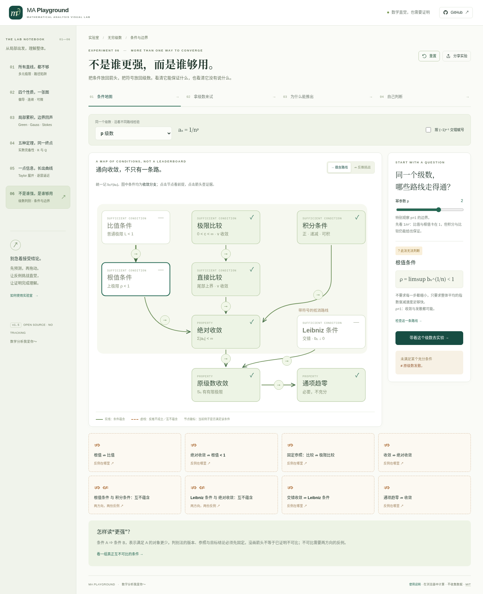
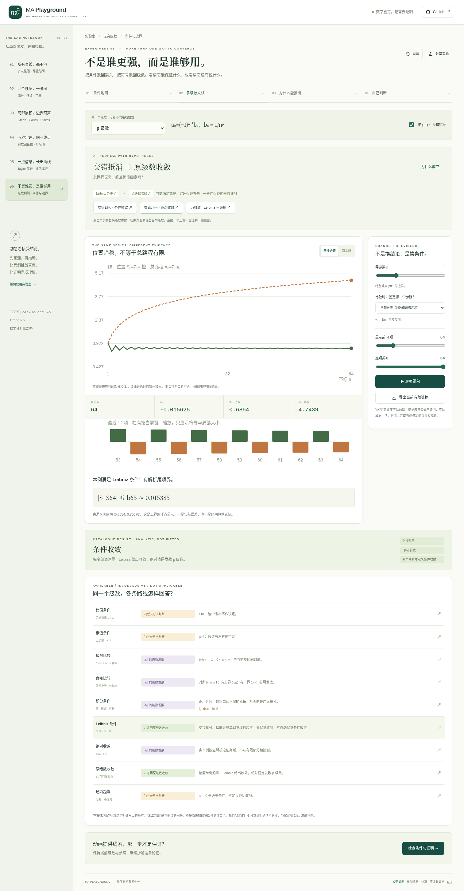

<div align="center">

# MA Playground
### Mathematical Analysis Visual Lab · 数学分析可视化实验室

**让数学直觉，经得起证明。**

七个完整实验，把观察、计算、定义与证明接起来。无后端、无登录、无 CDN，可完全离线运行。

[English](README.en.md) · [一致收敛指南](docs/UNIFORM-GUIDE.md) · [级数数学证明](docs/SERIES-MATHEMATICS.md) · [实际验证](docs/VERIFICATION-v1.6.md) · [交付状态](docs/STATUS.md)

</div>



## v1.6 · 每个点，还是所有点

**逐点收敛时，什么时候能找到一个同时控制整个定义域的 N？**

第七个实验把一致收敛放回量词、误差和极限交换中：先看固定点，再追踪随 N 逃跑的点；再用解析上确界、面积、斜率和 M 预算检查“同一个 N”到底能否保护所有点。四个页面都带默认展开的「本页导览」卡片：核心问题、三步操作、重点观察、本页结论、常见误区和完整指南入口。

实验覆盖 xᴺ 的定义域反例、几何级数、交错但不正规、移动尖峰、细小波纹和常数漂移，并明确区分有限采样与解析证明。详细操作见 [UNIFORM-GUIDE.md](docs/UNIFORM-GUIDE.md)，推导见 [UNIFORM-MATHEMATICS.md](docs/UNIFORM-MATHEMATICS.md)。

## v1.5 · 不是谁更强，而是谁够用

**同一个级数，比值与根值都停在 1，为什么另一路仍能判断？**

第六个实验不把判别法排成一列。它固定判别法的版本、参照和目标结论，组织成一条连续学习路径：

**条件地图 → 拿级数来试 → 为什么能推出 → 自己判断。**

图上 9 个条件/性质节点、8 条定理箭头和 8 个反推/不可比问题。绿色实线表示一般蕴含，虚线问题进入反例；节点颜色才表示当前级数满足哪些条件。改参数不会改变定理。

### 不是公式百科

| 操作 | 具体学到什么 |
|---|---|
| 点节点、点箭头 | 带着当前级数进入实验，验证左条件和右条件，而不是跳到孤立定义。 |
| 切换正例、反例、边界 | 根值可行但普通比值无极限；绝对收敛但根值等于 1；固定参照夹得住但商无极限。 |
| 改 p、q、交错赋号 | 区分非负项、绝对收敛、条件收敛与发散；交错只是形式，不是结论。 |
| 更换同一个参照 | “这条路没提供证据”不会改变级数本身敛散；零/无穷商的有效单向扩展保留。 |
| 逐项播放和拖动前缀 | 查看有限比值、根值、比较商、积分矩形；无限结论不从样本拟合。 |
| 两本账同步变化 | 位置 S_N=Σaₙ 与总路程 A_N=Σ|aₙ| 分开；Leibniz 满足条件时才给余项夹逼。 |
| 双向不可比实验 | 两个方向各有反例，也有同时满足的例子；不把“没画箭头”当成已证不可比。 |
| 64 步推导、8 道解释型自测 | 前提、结论、反例和无结论分开，修改作答会清除旧反馈。 |



八个通项族：几何项、p 项、望远镜项、齿状几何、有界摆动系数、对数边界、稀疏非负项、不单调抵消。参数化案例均有独立解析证明，不接受任意通项输入，也不宣称能自动判定所有无穷级数。

### 必须写清的范围

- 比值节点用**普通极限 L<1**；根值节点用**上极限 ρ<1**，允许普通根值极限不存在。ρ 不是当前样本的最大值。
- 极限比较节点明确使用 **0<c<∞ 的双向版**。c=0/∞ 的有效单向结论另列，不能笼统说“极限比较失效”。
- 极限比较→直接比较使用**固定的同一参照**；参照敛散已独立知道。不把“允许任取参照”与“当前参照能否给证据”混为一谈。
- 标准积分条件要求正、连续、最终不增的插值；锯齿序列不能假装满足单调性。
- “Σ|aₙ| 发散”只否定绝对收敛。比值/根值大于 1 通过通项不趋零判原级数发散；两者不是同一种结论。
- 任一充分条件未满足，都不等于原级数发散。最终分类来自通项族的解析论证，独立于显示项数与动画。

详细证明及参考教材见 [SERIES-MATHEMATICS.md](docs/SERIES-MATHEMATICS.md)。

## 全部七个实验

| 实验 | 完整离线入口 | 内容 |
|---|---|---|
| 01 所有直线，都不够 | `dist/standalone.html` | 多元极限、不同路径、反证与三维示意。 |
| 02 四个性质，一张图 | `dist/relations-lab.html` | 偏导/连续/可微/偏导连续的关系图、正例与反例。 |
| 03 局部累积，边界回声 | `dist/field-lab.html` | Green→平面通量→Gauss→Stokes，局部抵消与边界效应。 |
| 04 五种定理，同一终点 | `dist/completeness-lab.html` | 实数完备性的有向证明环、精确有理数二分、ℝ/ℚ。 |
| 05 一点信息，长出曲线 | `dist/taylor-lab.html` | 0→12 阶逐层生长、展开点、余项和收敛边界。 |
| 06 不是谁强，是谁够用 | `dist/series-lab.html` | 级数判别条件图、比较参照、符号抵消与失效边界。 |
| 07 每个点，还是所有点 | `dist/uniform-lab.html` | 逐点/一致/正规收敛、极限交换、逃跑点与解析证书。 |

**每个离线入口都包含完整七模块应用，只是初始页面不同。** 原有双函数比较仍可由 `#lab=differentiability&mode=classic` 进入。既有数学与浏览器检查保留；导航总数随新模块增至 7。

操作/证明：[偏导关系](docs/RELATIONS-GUIDE.md)、[统一积分](docs/FIELD-GUIDE.md)、[完备性](docs/COMPLETENESS-GUIDE.md)、[Taylor](docs/TAYLOR-GUIDE.md)。

## 立即运行

**无需安装：** 在完整交付包中双击 **`dist/series-lab.html`**。不请求 CDN、外部字体或 API。分享本机地址不等于把文件上传到网络。

**开发：** Node.js 22+，无 npm 运行或构建框架依赖。

```bash
npm run dev        # 本地开发服务器
npm run verify     # 语法、数学/状态/工程测试、生产构建
npm run preview    # 浏览 dist/ 生产构建
```

普通模块入口 `index.html` 需经 HTTP 打开；双击离线请使用合并 HTML。Git 源码不跟踪 dist，克隆源码后先 `npm run build`。

## 测试和实际范围

```bash
npm test
npm run check
npm run build
# 下列仅为开发测试依赖，不参与应用运行
python -m pip install -r tests/requirements.txt
python -m playwright install chromium
npm run test:ui         # 全部七套，默认真实 HTTP 模块版
npm run test:ui:series  # 仅第六套
npm run test:ui:uniform # 仅第七套
```

本地 v1.6 已通过 **275 项 Node 检查**；七套 Chromium 检查由 GitHub Actions 在推送后执行并记录在 [v1.6 验证记录](docs/VERIFICATION-v1.6.md)。新增实验及 v1.5 页面均带有按页面阶段切换的本页导览卡片。

当前环境的浏览器策略阻止 HTTP 导航；浏览器检查显式采用 `--offline-harness`，注入**真实构建的完整离线 HTML** 执行，没有修改或规避浏览器策略。HTTP 资源及根路径/仓库子路径另由真实 Node 服务请求检查。GitHub Actions Run #18 已通过并完成 Pages 部署，线上地址已做基本验收；仍不声称浏览器 HTTP 模块加载全链路、操作系统文件策略、Safari/Firefox 或完整屏幕阅读器验收。见 [验证记录](docs/VERIFICATION-v1.5.md)。测试不是一般数学证明。

## 工程结构

```text
src/
  app.js / state.js          导航、路由、分享、控制器生命周期
  math.js / plots.js         原极限与经典比较
  relations-*.js             偏导逻辑图
  field-*.js                 Green–Gauss–Stokes
  completeness-*.js          完备性与精确有理数构造
  taylor-*.js                解析导数、逐层生长、误差与证明
  series-math.js            独立解析案例、判别状态、稳定读数
  series-state.js           白名单、参数范围、路线恢复
  series-plots.js           有向图、不同条件透镜、两本账
  series-lab.js             生命周期、逐项动画、答案草稿
  series-content.js         路线、完整推导、解释型自测
  uniform-*.js              一致收敛解析模型、量词地图、证明与交互
styles/                     纸白/鼠尾草绿的笔记本视觉
scripts/                    无依赖构建、完整离线合并、本地服务器
tests/                      数学/状态/内容/工程、七套浏览器检查
docs/                       操作、数学、验证和实际截图
.github/workflows/          测试成功后从 main 部署 Pages
```

动画需主动播放，支持暂停与减少动态效果；切页、隐藏页面或退出模块清理动画。手机重排关系链，节点、箭头、控制器保留键盘操作与文字替代。

## 部署与交付

`npm run build` 输出纯静态 dist，支持根路径与 `/MA_playground/`。GitHub Actions Run #18 已通过并部署：[线上地址](https://xby474-dev.github.io/MA_playground/)。

提交、基线、差异补丁、bundle 和核验材料见交付包 `delivery/`；后续更新仍应读取真实远端历史，不要用本地 bundle 强制覆盖。详见 [STATUS.md](docs/STATUS.md) 与 [DEPLOYMENT.md](docs/DEPLOYMENT.md)。

## 贡献与许可

MIT。主要 UI 为中文。新增实验必须提供数学条件、证明/反例、教学目的和测试，不增加空白章节。见 [CONTRIBUTING.md](CONTRIBUTING.md)。不分发系统字体、教材扫描或第三方整段教材，不含令牌和环境秘密。

> 数学分析我爱你～
>
> 保留最初 README 的这句话：让“会算”更接近“真正理解”。
