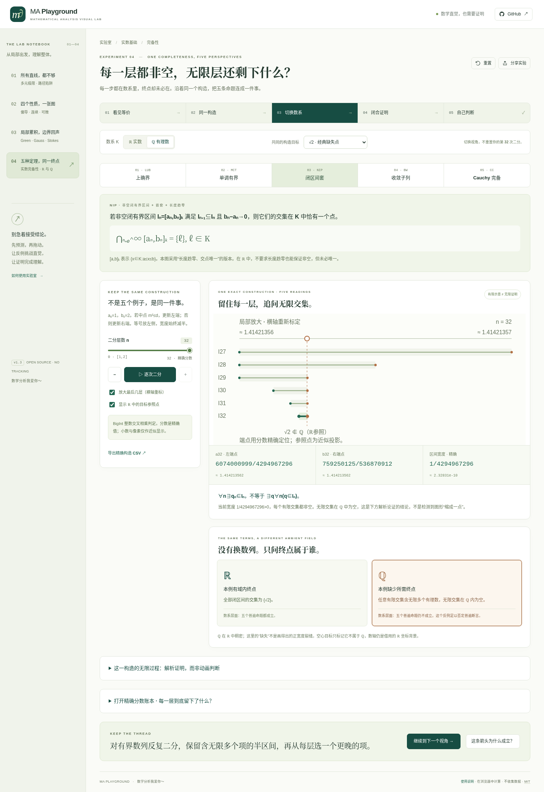

<div align="center">

# MA Playground
### Mathematical Analysis Visual Lab · 数学分析可视化实验室

**让数学直觉，经得起证明。**

四个完整实验，把观察、计算、定义与证明接起来。无后端、无登录、无 CDN，可完全离线运行。

[English](README.en.md) · [完备性操作指南](docs/COMPLETENESS-GUIDE.md) · [五条完整证明](docs/COMPLETENESS-MATHEMATICS.md) · [实际验证](docs/VERIFICATION.md) · [交付状态](docs/STATUS.md)

</div>


## v1.3 · 五种定理，同一个终点

**每一步都是有理数，为什么终点未必还在有理数里？**

第四个实验围绕这个问题，将上确界原理、单调有界定理、闭区间套、Bolzano–Weierstrass 和 Cauchy 完备性组织成一个可点击的证明环：

```text
上确界 → 单调有界 → 闭区间套 → 收敛子列 → Cauchy 完备
   ↑__________________________________________________|
```

点击节点：进入同一组精确二分的不同视角。点击箭头：展开仅使用起点条件的四步证明。任选两个节点，路线规划器展示实际有向证明路径；反向关系也需要沿图走通，不能凭一条正向证明宣布等价。

**看见等价 → 同一构造 → 切换数系 → 闭合证明 → 自己判断。**

### 一个构造，不是五个互不相干的例子

从 `[a₀,b₀]=[1,2]` 开始，只比较有理中点的平方与 `d`。`m²≤d` 留右半边，否则留左半边。得到精确有理端点，且 `bₙ−aₙ=2⁻ⁿ`。

| 视角 | 可以亲手检查什么 |
|---|---|
| 上确界 | 输入有理候选；严格构造一个更大的集合元素，或一个更小的上界，而非只显示“错误”。 |
| 单调有界 | 左端点逐层上升、右端点管住尾部；有限图形和全体 n 的不等式分开。 |
| 闭区间套 | 逐层保留、局部放大、查看精确宽度；区分每个有限交集非空和无限交集在 ℚ 中为空。 |
| BW | 从 `zⱼ=(−1)ʲaⱼ` 挑出偶/奇子列，保留原始下标；证明在 ℚ 中不存在任何收敛子列，不只否定两个展示选项。 |
| Cauchy | 独立挑选相隔很远的两项；调节 ε 和尾部起点，用对所有尾项成立的解析界检查条件。 |

目标可选 √2、√3、3/2。切换 ℝ/ℚ 不重置数据。3/2 的正常对照提醒学生：一个有理数列收敛，不等于有理数系完备。六道带解析的迁移题检查数系、量词、子列、相邻差和区间条件。



### 数学范围必须明确

证明环在**阿基米德有序域 K**这一共同框架下成立，ℝ 与 ℚ 都满足这些基础条件。闭区间套采用“非空闭有界区间、嵌套、长度趋零 ⇒ 唯一交点”的版本。域内存在性不能换成“在更大的 ℝ 中存在”。详见 [完整定义与证明](docs/COMPLETENESS-MATHEMATICS.md)。

绿色箭头在 ℚ 下仍是正确的条件蕴含；五个全称命题在 ℚ 中都不成立。例子的成功/失败和整个数系的性质分别显示。ℚ 稠密，图上的空心参照点不表示一个正宽度的“裂缝”。

二分、候选检查、尾项差和 CSV 使用 **BigInt 有理数运算**。没有用浮点 `sqrt` 预先决定二分；平方根仅作为 ℝ 坐标中的绘图参照。像素可能重合，精确分数仍保留。数值测试不是无限过程的证明，也没有任意定理自动证明器。

## 原有三个实验完整保留

**01 · 所有直线，都不够。** 比较 `x²y/(x⁴+y²)` 的直线和抛物线路径。保留三维示意、路径对照、严格反证、分享与 CSV。

**02 · 四个性质，一张图。** 偏导存在、连续、可微、偏导连续的可点击逻辑图。四个光滑正例、经典反例和新函数判断；绿色定理箭头与虚线逆推分开。候选平面、双侧截面、偏导振荡、归一化误差与证明联动。见 [关系实验指南](docs/RELATIONS-GUIDE.md)。旧双函数比较继续由 `#lab=differentiability&mode=classic` 访问。

**03 · 局部累积，边界回声。** Green 环流 → 平面通量桥梁 → Gauss 体元 → Stokes 曲面 → 统一视角。独立解析积分、内部边界抵消、定向、孔洞、同边界曲面变形与八道自测。见 [场实验指南](docs/FIELD-GUIDE.md)。

新增第四模块没有删除前三模块的数学、内容或检查。品牌副标题从“多元微积分”扩为“数学分析”，项目名 MA Playground 保持不变。

## 立即运行

**不安装环境：** 在完整交付包中双击 `dist/completeness-lab.html`。这是包含所有四个实验的完整单文件，并非单独演示。

| 完整离线入口 | 初始页面 |
|---|---|
| `dist/completeness-lab.html` | 实数完备性的等价图 |
| `dist/relations-lab.html` | 偏导与可微关系图 |
| `dist/field-lab.html` | Green–Gauss–Stokes |
| `dist/standalone.html` | 多元极限 |

都不依赖 Node、API Key、外部字体、公式 CDN 或网络请求。

**开发运行：** Node.js 22+，没有 npm 运行依赖或构建框架依赖。

```bash
npm run dev        # 本地开发服务器
npm run verify     # 语法、数学/状态/工程测试、生产构建
npm run preview    # 本地浏览 dist/ 生产构建
```

普通 ES-module 入口 `index.html` 应经 HTTP 打开；双击离线使用上表中合并后的 HTML。分享本机文件地址不会把文件上传到网络。

## 测试与边界

```bash
npm test
npm run check
npm run build

# 只用于开发测试，不参与应用运行
python -m pip install -r tests/requirements.txt
python -m playwright install chromium
npm run test:ui
```

v1.3 实际通过 **154 项 Node 检查**，以及四套 Chromium 检查 **29 + 37 + 27 + 38 = 131 项**。默认浏览器脚本使用生产 HTTP 入口；受环境策略限制时，显式 `--offline-harness` 在空白页中注入实际单文件 HTML，不修改浏览器策略。当前交付采用后者，真实 HTTP 资源由 Node 服务器独立验证。

因此不声称已完成浏览器 HTTP 模块加载全链路、操作系统文件权限、Safari/Firefox 或完整屏幕阅读器验收。GitHub Actions Run #8 已完成四套浏览器检查，公开 Pages 已验证可访问。全部记录见 [VERIFICATION.md](docs/VERIFICATION.md)。

## 工程结构

```text
src/
  app.js / state.js          全局导航、路由、分享、控制器生命周期
  math.js / plots.js         原极限和经典比较（保留）
  relations-*.js             偏导与可微关系实验（保留）
  field-*.js                 Green–Gauss–Stokes（保留）
  completeness-math.js       BigInt 分数、精确构造、见证、尾界、图路径
  completeness-state.js      分享参数白名单、边界、默认值
  completeness-plots.js      等价图、区间、集合、数列/子列和尾部 SVG
  completeness-content.js    统一学习路径、定义、五条证明、迁移题
  completeness-lab.js        交互、焦点、动画、草稿、CSV
styles/                     共用奶油白/鼠尾草绿笔记本视觉体系
scripts/                    无依赖构建、单文件合并、本地服务器
tests/                      数学/内容/状态/工程与四套浏览器回归
docs/                       数学全文、指南、架构、验证与部署说明
.github/workflows/          全部检查成功后在 main 部署 Pages
```

局部监听与动画随路由销毁；滑块更新不重建输入。手机将等价图重排为纵向有向环，并把同步层数控件放到图旁。状态分享不包含学生答案；答题草稿只留在当前页面内存。关键结论有文字、精确数值和证明，不依赖只看颜色或像素。

## 部署与交付状态

`npm run build` 输出纯静态 `dist/`，支持根路径与 `/MA_playground/` 子路径。既有 Pages 工作流通过 `test:ui` 调用四套回归，验证成功后才允许部署。仓库管理员仍需授权并配置 Pages 为 GitHub Actions。

**v1.3 已以普通提交推送到 `xby474-dev/MA_playground`，GitHub Actions Run #8 已通过，GitHub Pages 已公开更新。** 本地提交、基线、差异补丁、bundle 和核验材料见交付包 `delivery/`；后续更新仍应读取真实远端历史，不要用本地 bundle 强制覆盖。详见 [STATUS.md](docs/STATUS.md) 与 [DEPLOYMENT.md](docs/DEPLOYMENT.md)。

## 贡献与许可

新增实验应同时提供条件、证明/反例、交互目的和测试，不增加空白章节。欢迎报告数学错误、理解障碍和无障碍问题。见 [CONTRIBUTING.md](CONTRIBUTING.md)。当前主 UI 为中文，无任意公式输入或通用 CAS。

MIT。作者核对资料列在 [REFERENCES.md](docs/REFERENCES.md) 及各数学文档中；证明编排、程序与 SVG 独立实现。没有分发系统字体、教材扫描页或第三方整段教材。

> 数学分析我爱你～
>
> 保留最初 README 的这句话：让“会算”更接近“真正理解”。
