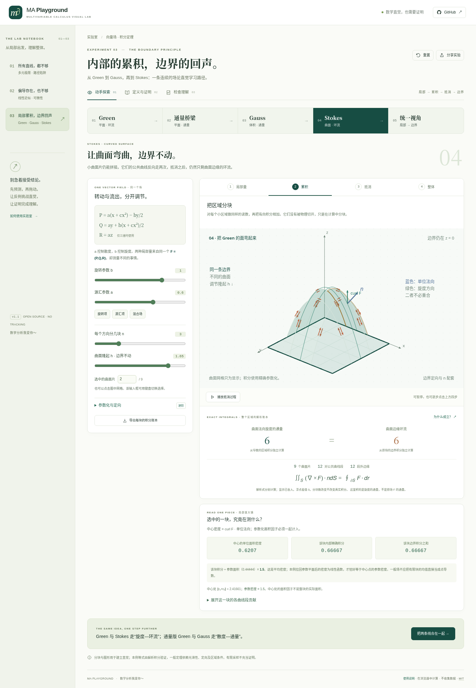
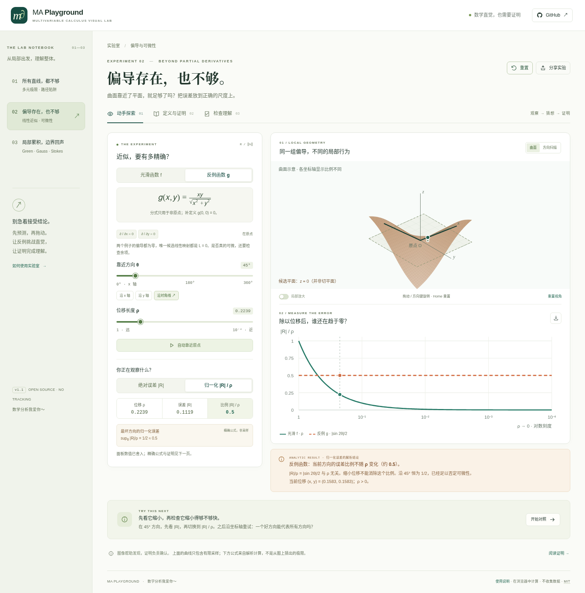
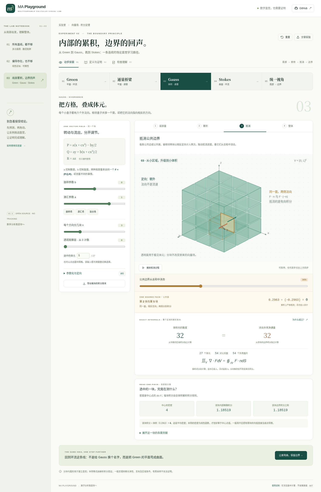

<div align="center">

# MA Playground

### Multivariable Calculus Visual Lab · 多元微积分可视化实验室

**让数学直觉，经得起证明。**

三个完整的交互实验，连接几何、公式、定义与证明。不是一个通用三维绘图器。

[English](README.en.md) · [原有实验数学说明](docs/MATHEMATICS.md) · [统一场实验](docs/FIELD-GUIDE.md) · [积分定理推导](docs/FIELD-MATHEMATICS.md) · [测试记录](docs/VERIFICATION.md) · [部署说明](docs/DEPLOYMENT.md)

</div>



**v1.1 新增：局部累积，边界回声。** 保留原有多元极限与可微性实验，新增一条 Green → 平面通量 → Gauss → Stokes 的连续学习路径。

> 数学分析我爱你～
>
> 项目保留了最初 README 的这句话。做这个实验室，是为了把“会算”变成“真正理解”。

## 三个实验，三个学习阶段

每个实验都有 **动手探索 → 定义与证明 → 检查理解**，不是只有动画或一页代码。

### 01 · 所有直线，都不够

研究非原点处的

$$F(x,y)=\frac{x^2y}{x^4+y^2},\qquad F(0,0)=0.$$

选择直线、抛物线或竖直线，固定系数，再让参数从正侧或负侧靠近零。平面路径、三维示意、当前数值和对数尺度曲线同步更新；最多保留四条比较路径。

所有固定直线都得到极限 0；抛物线 $y=cx^2$ 得到 $c/(1+c^2)$。页面分别提供代入式、序列反证与 ε–δ 反证，也明确处理不在有限斜率族中的竖直线。

### 02 · 偏导存在，也不够

比较

$$f(x,y)=x^2+y^2,\qquad g(x,y)=\frac{xy}{\sqrt{x^2+y^2}}\ ((x,y)\ne0),\qquad g(0,0)=0.$$

两个函数在原点的两个偏导均为零，唯一候选线性映射都是 $L=0$。转动方向、缩小位移，切换绝对误差与归一化误差，观察真正的区别：

$$\frac{|R_f|}{\rho}=\rho\to0,\qquad\frac{|R_g|}{\rho}=\frac{|\sin 2\theta|}{2}.$$

三维视图与方向扫描提供几何观察。所有方向的最坏误差使用**解析上确界**，不是采样取最大。反例中的平面明确标为“候选平面”，不称为切平面。



### 03 · 局部累积，边界回声

不是三个孤立的公式页面，而是一个参数连续、交互一致的统一实验：

**Green 环流 → 平面通量桥梁 → Gauss 体元 → Stokes 曲面 → 统一视角。**

每站沿着 **读一个局部 → 分块累积 → 抵消公共边界 → 只剩外边界** 展开。选一个小区域或体元，查看每条边／每个面的独立积分；拖动抵消进度，公共边以相反方向走两次，公共面以相反法向计入两次。被抵消的是有向积分，不是向量场本身。

- **同一向量场。** 调节源汇项、旋转项、空间分布与区域大小，比较旋度和散度读数；支持负值、定向反转、网格细化、分层观察和相机旋转。
- **同一边界，不同曲面。** 将平面隆起，观察单位法向旋度、面积因子和参数密度，区分实际曲面积分与平面面积积分。
- **解析计算，不伪造相等。** 区域内部的积分与各条边／各个面的边界积分分别计算。共边两侧各自积分，不把一个结果复制并取负。有限绘图网格不参与积分。
- **推导可展开。** 一维基本定理、Fubini、矩形 Green、长方体 Gauss、曲面拉回与链式法则；明确哪些步骤证明了本例、哪些一般定理需要进一步论证。
- **条件可以探索。** 奇点圆盘与带孔环域的对照，解释内边界、光滑性和定向；新增八道带原因的理解检查。

初次学习见 [五站操作指南](docs/FIELD-GUIDE.md)，完整公式与证明边界见 [FIELD-MATHEMATICS.md](docs/FIELD-MATHEMATICS.md)。本项目中的“场论”指向量微积分的统一直觉，不是物理学中的统一场理论。



## 现在运行

需要 **Node.js 22 或更高版本**。无 npm 依赖，无数据库，无 API Key。

```bash
git clone https://github.com/xby474-dev/MA_playground.git
cd MA_playground
npm run dev
```

打开终端打印的 `http://127.0.0.1:5173`。

构建生产版本：

```bash
npm run verify     # 语法检查、单元测试、生产构建
npm run preview    # http://127.0.0.1:4173
```

**完全离线的单文件版本：** 构建后直接打开 `dist/standalone.html`；`dist/field-lab.html` 则直接进入新的统一场实验。两个文件都包含全部三个实验。它将同一套模块与样式合并进一个 HTML，无需服务器，不加载外部字体、脚本或公式 CDN。模块版的 `index.html` 则应通过 HTTP 服务器打开，而不是直接使用 `file://`。

## 交互功能

- 路径与方向预设、对数尺度滑块、正负参数、自动靠近与暂停、局部放大。
- 可拖动及键盘控制的三维曲面；平面路径与误差极坐标图。
- 同一份数学计算驱动图形、数值与 CSV，支持最多四条路径比较。
- 分享链接保存当前实验参数，刷新或转发可还原；剪贴板失败时提供手动复制界面。
- 原有六道与新增八道自测题，带正确理由、错误反馈和当前会话内的作答保留。
- 原有实验导出 101 个非零尺度；统一场实验导出所有小块的独立内部／边界解析积分。两者都保留参数与验证范围声明。
- 桌面与手机布局、原生 MathML、键盘操作、减弱动态效果设置、打印友好的证明页。

## 数学上的承诺与边界

**有限采样不证明一般命题。** 原点值、路径极限和二元极限分开；导数候选与已经证明的导数分开；所有近似数值与解析公式分开。

三维图使用有限网格和独立坐标显示比例，不应靠屏幕上的视觉角度判断导数。极限反例的细窄脊线可能被网格漏采，因此精确路径代入与证明才是依据。方向扫描图的径向长度是误差量，不是输入位移。

详细推导、量词、双侧方向导数的说明，以及测试能证明什么、不能证明什么，见 [MATHEMATICS.md](docs/MATHEMATICS.md)。

## 测试

```bash
npm test                    # Node 原生测试运行器；不安装任何 npm 包
npm run check               # 全部 JS 语法检查与外部运行时依赖检查
npm run build               # 生成模块版和单文件版
```

浏览器回归测试需要 Python 3.10+ 与 Playwright（仅测试使用）：

```bash
python -m pip install -r tests/requirements.txt
python -m playwright install chromium
npm run build
npm run test:ui
```

默认浏览器测试启动生产服务器，并访问 `/MA_playground/` 子路径，验证 ES modules 与 GitHub Pages 路径兼容。受限环境还提供 `--offline-harness` 模式，通过 `about:blank` 注入真实生成的单文件 HTML 测试 UI，**不修改浏览器安全策略**。两种模式的验证范围不同，记录见 [VERIFICATION.md](docs/VERIFICATION.md)。

## 工程结构

```text
index.html                  页面外壳、导航、原生对话框
src/
  math.js                   纯数学：函数、参数化、余项、解析上确界
  state.js                  分享链接、输入白名单、边界校验
  plots.js                  SVG 图表与 Canvas 三维投影
  content.js                MathML、教学内容、完整证明、自测题
  app.js                    状态更新、交互、分享、导出与生命周期
  icons.js                  内联界面图标
  field-math.js             解析积分、独立边/面积分、共边界拓扑账本
  field-state.js            新实验参数、分享链接和输入校验
  field-plots.js            二维/三维 SVG，几何采样与数学引擎分离
  field-content.js          连续学习路径、证明、自测与条件检查
  field-lab.js              有生命周期的实验控制器与动画
styles/app.css              原有响应式笔记本风格界面
styles/fields.css           新实验布局、图形与移动端适配
scripts/                    本地服务器、构建、语法检查、单文件合并
tests/                     数学/状态/内容/工程测试及 Chromium 回归测试
docs/                      数学、工程决策、验证、部署与无障碍说明
.github/workflows/          CI 和 GitHub Pages 发布
```

## 部署

仓库已包含 CI / GitHub Pages 工作流：测试和构建成功后，`main` 分支可以部署 `dist/`；拉取请求只测试，不部署。

管理员首次需要在 **Settings → Pages → Source** 选择 **GitHub Actions**。预定地址为：

`https://xby474-dev.github.io/MA_playground/`

**这个地址只有在实际推送、配置 Pages 并部署成功后才生效。** 安装包中的 [交付状态](docs/STATUS.md) 记录此次是否真正完成远端发布，避免将本地构建误写成上线。

也可将 `dist/` 上传到其他静态网站服务，无需服务器端运算。详细步骤见 [DEPLOYMENT.md](docs/DEPLOYMENT.md)。

## 参与改进

欢迎提交数学错误、交互困惑或无障碍问题。新增实验应先提供定义、反例或证明，再实现交互和测试；不要加入未完成的空白章节。见 [CONTRIBUTING.md](CONTRIBUTING.md)。

本版界面以中文为主，保留英文实验名；尚未提供完整英文界面。没有账号、分析追踪、AI 代答和任意公式执行。

## 参考与许可

数学推导为本项目独立撰写。延伸阅读使用 OpenStax *Calculus Volume 3* §4.2、§4.4、§6.4、§6.7、§6.8；完整资料与技术文档见 [REFERENCES.md](docs/REFERENCES.md)。

代码与原创教学内容采用 [MIT License](LICENSE)。不捆绑任何第三方字体文件。
